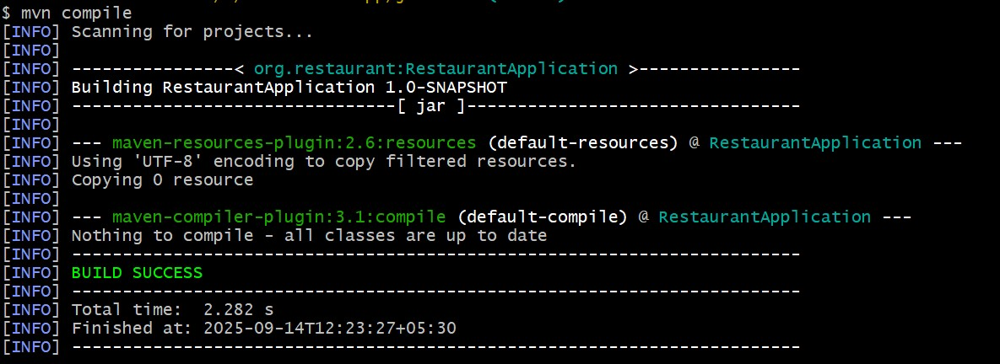
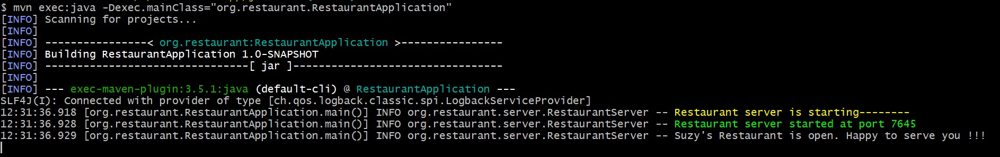
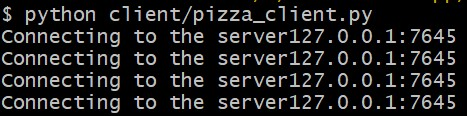

# Socket Programming; Java Server with Multi-language Clients
This project demonstrates socket programming.How a Java-based TCP server can communicate with clients written in different programming languages such as Python, C++, C, and JavaScript.
It is designed for learning purposes to show how socket programming concepts are consistent across languages.

## Badges
[](https://realpython.com/python-sockets/)

[](https://docs.python.org/3/library/threading.html)

## 📂 Project Structure
### java-lan
The java-lan/ folder contains the Java server implementation. It listens for client connections on a given port and exchanges messages.
### Clients
The clients/ folder in language specific directory contains client implementations in:<br>
Python – simple socket client using Python’s socket module.<br>
C++ – client using <sys/socket.h> APIs.


## 🛠 Build Instructions
### Prerequisites

Install [Java 20+](https://adoptium.net/)

Install [Apache Maven](https://maven.apache.org/install.html)

Verify installation
```bash
java -version
mvn -version
```
### Build
Clone the project

```bash
  https://github.com/NileshChauhan-CHOCOS/restaurant-app.git
```

Go to the project directory

```bash
    cd restaurant-app/
```
Go to root directory of server
```bash
    cd java-lan/
```
Build

```bash
   mvn clean install
```

## 🚀Run Locally
Compile server
```bash
mvn compile
```


Start the Server
```bash
mvn exec:java -Dexec.mainClass="mvn exec:java -Dexec.mainClass="org.restaurant.RestaurantApplication"
```


### Client
#### python
Go to root directory of client
```bash
    cd python-lan/
```
Start client
```bash
    python client/pizza_client.py
```


## 🛑 Stopping the Server
To stop the server, simply press:

**CTRL + C** in the **terminal/command** prompt where the server is running.

This sends a termination signal (**SIGINT**) that gracefully **shuts down the Java process**.

If the server is running in the background (e.g., with & on Linux/macOS), find and kill it:
```bash
ps -ef | grep RestaurantApplication   # find process
kill -9 <PID>                         # stop server by process ID
```
On Windows (PowerShell / CMD):
```bash
tasklist | findstr java
taskkill /F /PID <PID>
```

